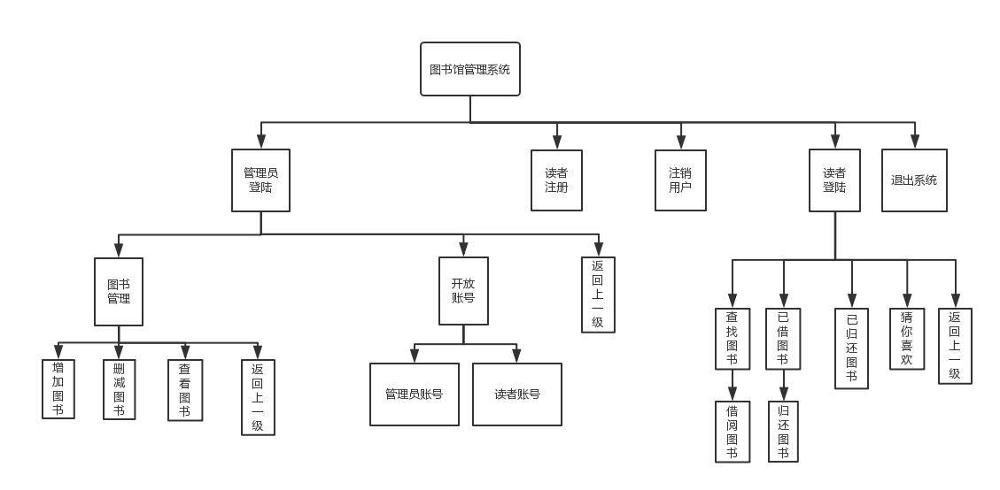

# 南邮图书馆管理系统

```
    **********************************
    *  系统环境：Windows10 操作系统     *
    *  IDE环境：Code Blocks 17.12     *
    *  作者:陈力、郝书睿、邵侠鸿         *
    **********************************
```

## 完成情况：

---

#### 第一次提交 : **2018-11-27   14:35**

##### 目前实现功能为 :

- 用户登录

##### 仍待实现:

- 注销
- 用户注册


所有类型都用结构体完成，下次提交可能换用类。

自己按照接口写了一些样本数据，数量较少，使用了多个CSV表链接，如果数据量大，考虑使用数据库完成


---

#### 第一次提交 : **2018-11-28   21:25**

##### 实现功能:

- 管理员对图书的增删改查


##### 仍待实现:

- 图书表的对应关系
- 借阅还书功能

---

#### 第三次提交 : **2018-11-30  8:10**

完结撒花!~~~

实现功能:模拟数据表操作4张表(.csv)

- 管理员对图书的增删查
- 普通用户的借书、还书功能、查看借阅图书、归还图书、热门图书、推荐图书
- 登录用户的注销


---

## 项目说明：

##### 整体框架图




##### 表关系:

